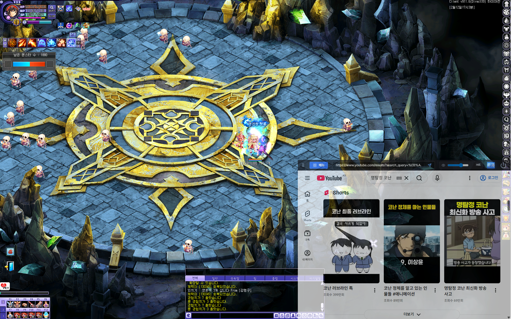

# 🎮 TW-Overlay (TalesWeaver Companion Browser)

테일즈위버(TalesWeaver) 플레이어를 위한 **지능형 다중 창 오버레이 브라우저**입니다. 게임 화면과 연동되는 자석형 위젯과 독립된 브라우저 창을 통해 최상의 플레이 환경을 제공합니다.

## 📸 스크린샷

## ✨ 주요 기능

*   **⚡ 고성능 분석 엔진 (New):** `SharedArrayBuffer` 기반 Zero-copy 기술을 도입하여 화면 분석 시 발생하는 CPU 및 메모리 부하를 최소화했습니다.
*   **🧩 지능형 창 관리:** 새롭게 설계된 Registry 아키텍처를 통해 모든 오버레이 창이 더 빠르고 정확하게 게임 화면과 동기화됩니다.
*   **🚀 게임 네트워크 최적화 (Fast Ping):** 네이글 알고리즘(Nagle's Algorithm)을 버튼 하나로 제어하여 게임 응답 속도(핑)를 개선할 수 있습니다.
*   **⏰ 필드 보스 알림:** 주요 필드 보스의 출현 시간을 감지하여 소리 알림을 제공합니다. 정각, 1분 전, 5분 전 등 원하는 시점 선택과 보스별 커스텀 사운드 설정이 가능합니다.
*   **📖 지능형 약어 사전 (Abbreviation Search):** 게임 내에서 사용하는 복잡한 약어들의 풀네임과 상세 설명을 검색 한 번으로 확인하세요.
*   **🧲 정밀 자석 트래킹:** 게임 창의 위치를 실시간 감지하여 모든 독립 창이 자석처럼 따라다니며 지정한 위치를 기억합니다.

## 🚀 설치 및 사용 방법

### 1. 설치하기
[Releases](https://github.com/drt0927/tw-overlay/releases) 페이지에서 최신 버전의 `twOverlay-Setup-1.6.2.exe` 파일을 다운로드하여 설치하세요. 기존 사용자는 앱 내 업데이트 기능을 사용할 수 있습니다.

### 2. 실행하기
1. 테일즈위버를 실행합니다.
2. `twOverlay`를 실행하면 자동으로 게임 창 우측에 사이드바가 나타납니다.
3. 사이드바의 각 아이콘을 클릭하여 기능을 조작할 수 있습니다.

## 📝 최신 업데이트 내역 (v1.6.2)
- **사용성 개선:** 마우스 호버 여부에 따라 오버레이 상단 툴바가 자동으로 숨겨지도록 기능을 고도화했습니다. (이벤트 기반 방식)
- **최적화:** 오버레이 클릭 시 테일즈위버 게임 클라이언트가 다른 앱 뒤로 숨지 않도록 Z-Order 샌드위치 로직을 극대화했습니다.

## 📝 이전 업데이트 내역 (v1.6.1)
- **기능개선: 오버레이 창 이동 제한 해제** (게임 창 밖으로도 자유롭게 스티커처럼 배치 가능).
- **로직고도화: 동적 위치 동기화 개선** (창 밖에서도 게임 창과 함께 안정적으로 이동).

## 📄 라이선스
이 프로젝트는 ISC 라이선스를 따릅니다.

---
**Note:** 이 프로그램은 게임 메모리를 변조하지 않는 안전한 외부 도구입니다.
