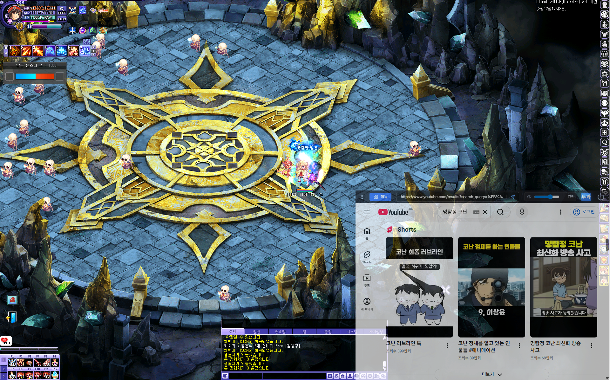

# 🎮 TW-Overlay (TalesWeaver Companion Browser)

테일즈위버(TalesWeaver) 플레이어를 위한 **지능형 다중 창 오버레이 브라우저**입니다. 게임 화면과 연동되는 자석형 위젯과 독립된 브라우저 창을 통해 최상의 플레이 환경을 제공합니다.

## 📸 스크린샷

## ✨ 주요 기능

*   **⏰ 필드 보스 알림 (New):** 주요 필드 보스의 출현 시간을 감지하여 소리 알림을 제공합니다. 정각, 1분 전, 5분 전 등 원하는 시점 선택과 보스별 커스텀 사운드 설정이 가능합니다.
*   **🧪 지능형 버프 매니저 (Buff Manager):** 1000px 대화면 기반의 버프 백과사전 및 계산기입니다. 내가 선택한 도핑 아이템의 총 효과를 실시간으로 합산해 보여주며, 사용자 정의 프리셋을 자유롭게 수정하고 저장할 수 있습니다.
*   **📖 지능형 약어 사전 (Abbreviation Search):** 게임 내에서 사용하는 복잡한 약어들의 풀네임과 상세 설명을 검색 한 번으로 확인하세요.
*   **🚀 성능 강화 (Performance Booster):** 게임 프로세스(`InphaseNXD`) 감지 시 CPU 우선순위를 자동으로 '높음(High)'으로 설정하여 프레임 안정성을 향상시켰습니다.
*   **🧲 정밀 자석 트래킹:** 게임 창의 위치를 실시간 감지하여 모든 독립 창이 자석처럼 따라다니며 지정한 위치를 기억합니다.

## 🚀 설치 및 사용 방법

### 1. 설치하기
[Releases](https://github.com/drt0927/tw-overlay/releases) 페이지에서 최신 버전의 `twOverlay-Setup-1.2.3.exe` 파일을 다운로드하여 설치하세요. 기존 사용자는 앱 내 업데이트 기능을 사용할 수 있습니다.

### 2. 실행하기
1. 테일즈위버를 실행합니다.
2. `twOverlay`를 실행하면 자동으로 게임 창 우측에 사이드바가 나타납니다.
3. 사이드바의 각 아이콘을 클릭하여 기능을 조작할 수 있습니다.

## 📝 최신 업데이트 내역 (v1.2.0)
- **신규: 필드 보스 알림 시스템 도입** (골론, 파멸의 기원, 스페르첸드, 골모답, 아칸).
- **신규: 보스 시간 지능형 시각화** (지나간 시간과 남은 시간을 색상으로 구분).
- **개선: 버프 프리셋 관리 기능 강화** (기존 프리셋 수정 후 덮어쓰기 저장 기능 추가).
- **개선: 사이드바 인터페이스** (보스 알림 설정을 위한 퀵 아이콘 추가).
- **안정성:** 다중 창 환경에서의 설정 동기화 로직 및 창 관리 안정성 향상.

## 📄 라이선스
이 프로젝트는 ISC 라이선스를 따릅니다.

---

## ⚖️ 장판 감지 기능에 관한 안내 (ScreenWatcher)

본 프로젝트는 테일즈위버 게임사의 **매크로 사용 금지 및 관련 처벌 정책**을 전적으로 지지하며, 게임의 공정성과 고유의 가치를 훼손할 의사가 없음을 분명히 밝힙니다.

개발자는 캐릭터의 자동 조작이나 게임 데이터 변조를 일체 금지하며, 오직 사용자의 **인지 보조**를 위한 알림 기능만을 제공합니다. 최종적인 판단과 조작은 항상 사용자의 몫입니다.

---
**Note:** 이 프로그램은 게임 메모리를 변조하지 않는 안전한 외부 도구입니다.
