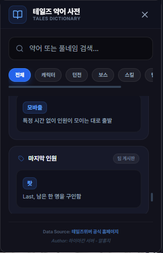

# 테일즈 약어 사전 (Tales Dictionary)

## 1. 기능 개요 및 목적
테일즈위버 게임 내에서 빈번하게 사용되는 각종 약어, 속어, 캐릭터 별칭, 던전 줄임말 등을 초보자나 복귀 사용자가 쉽게 이해할 수 있도록 제공하는 사전형 서비스입니다. 공식 홈페이지 및 커뮤니티의 데이터를 기반으로 실전 예시까지 포함하여 게임 적응을 돕습니다.

## 2. 주요 UI 구성 요소 설명
- **검색 바 (Search Bar):** 약어 또는 풀네임을 실시간으로 검색할 수 있는 입력 필드입니다.
- **카테고리 칩 (Category Chips):** 전체, 캐릭터, 던전, 보스, 스킬, 팀게(팀 게시판), 예시 등 특정 분류별로 데이터를 필터링할 수 있는 버튼입니다.
- **결과 리스트 (Result List):** 검색 및 필터링된 약어 정보를 카드 형태로 표시합니다.
- **약어 배지 (Abbreviation Badge):** 카드 내에서 실제 사용되는 줄임말을 강조하여 표시합니다.

## 3. 세부 기능 및 작동 방식
- **실시간 필터링:** 사용자가 검색어를 입력하거나 카테고리를 변경할 때마다 즉시 결과 목록이 갱신됩니다.
- **다중 검색 지원:** 약어 본문뿐만 아니라 설명 내의 키워드로도 검색이 가능합니다.
- **카테고리 특화 검색:** 특정 상황(예: 팀 게시판 모집글 해석)에 맞는 줄임말만 골라 볼 수 있습니다.
- **외부 링크 연동:** 상세한 가이드가 필요한 경우 테일즈위버 공식 홈페이지의 관련 게시글로 연결됩니다.

## 4. 데이터 출처
- **로컬 데이터:** `src/assets/data/abbreviations.json`
- **참고 사이트:** 테일즈위버 공식 홈페이지 공략 게시판 (하이아칸 서버 알롱지 님 작성 가이드)

## 5. 스크린샷

