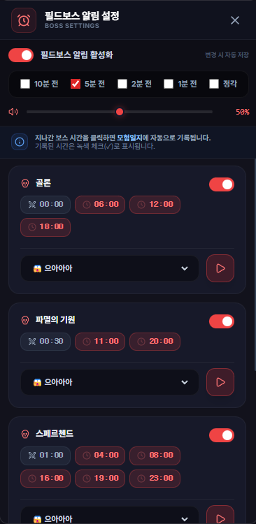

# 필드보스 알림 설정 (Boss Settings)

## 1. 기능 개요 및 목적
테일즈위버의 주요 콘텐츠인 필드보스 리젠 시간을 실시간으로 관리하고, 출현 전 사용자에게 알림을 제공하는 기능입니다. 게임 내 보스 처치 기록을 모험일지와 연동하여 효율적인 콘텐츠 스케줄 관리를 지원합니다.

## 2. 주요 UI 구성 요소 설명
- **알림 활성화 토글:** 전역 필드보스 알림 기능을 켜거나 끌 수 있습니다.
- **알림 시점 설정:** 보스 출현 10분 전, 5분 전, 2분 전, 1분 전, 정각 등 원하는 시점을 다중 선택할 수 있습니다.
- **마스터 볼륨 슬라이더:** 알림 사운드의 크기를 조절하고 미리 들어볼 수 있습니다.
- **보스별 개별 설정:** 각 보스(골론, 파멸의 기원 등)마다 알림 활성화 여부와 알림음을 다르게 설정할 수 있습니다.
- **시간 태그 (Time Tag):** 보스별 리젠 시간을 표시하며, 현재 상태(지남, 예정, 처치 완료)에 따라 색상이 변경됩니다.

## 3. 세부 기능 및 작동 방식
- **실시간 리젠 트래킹:** 서버 시간을 기준으로 보스 출현까지 남은 시간을 계산하여 UI를 갱신합니다.
- **지능형 알림 시스템:** 게임 창 상태에 따라 팝업 또는 Windows 네이티브 알림을 발송합니다.
- **모험일지 자동 연동:** 이미 지난 시간의 보스 태그를 클릭하면 해당 보스 처치 정보가 '모험일지'에 자동으로 기록됩니다.
- **상태 시각화:** 처치 기록이 완료된 시간은 녹색 체크(✓)와 함께 강조 표시되어 중복 처치를 방지합니다.

## 4. 데이터 출처
- **보스 시간 데이터:** `main` 프로세스에서 관리되는 실시간 보스 리젠 스케줄 데이터 (`bossTimes`)
- **알림 사운드:** `src/assets/sound/` 폴더 내의 오디오 에셋 목록

## 5. 스크린샷

