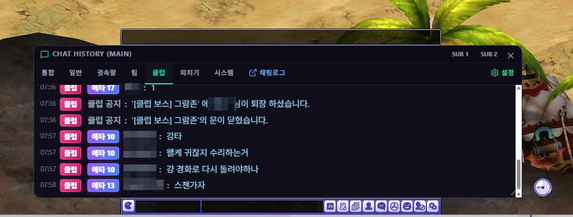

# 인게임 채팅 오버레이 위젯 (In-game Chat Overlay Widget)

## 1. 기능 개요 및 목적
게임 화면 위에 투명한 채팅 오버레이 창을 배치하여, 게임 플레이 및 사냥 중에도 클라이언트를 전환하지 않고 실시간 채팅 로그를 가독성 있게 확인하는 자석형 위젯입니다. 최대 3개(Main, Sub1, Sub2)의 멀티 오버레이 창을 띄워 독립적인 필터링 구성을 할 수 있습니다.

## 2. 주요 UI 구성 요소 및 조작법
- **멀티 탭 필터:** 각 위젯 창 상단 탭을 통해 전체, 일반, 귓속말, 팀, 클럽, 외치기, 시스템 채널별로 대화 로그를 즉시 전환 및 분리 필터링하여 감상합니다.
- **무한 스크롤 (Scroll history):** 채팅 창을 위로 스크롤하면 SQLite DB에 누적 기록된 이전 로그들을 150개 단위로 끝없이 로드하여 과거 대화 목록을 탐색할 수 있습니다.
- **클릭 투과 모드 (`Ctrl + Shift + T`):**
  - 단축키를 입력하면 오버레이 위젯이 마우스 클릭 신호를 투과시켜, 마우스 커서가 채팅 창 위에 있더라도 뒤에 위치한 인게임 요소(몬스터, 바닥 등)를 클릭할 수 있게 만듭니다.
  - 마우스 투과 중에는 창의 움직임이 고정되며, 다시 단축키를 누르면 편집 모드로 복원됩니다.
- **불투명도 조절:** 각 윈도우별로 배경의 투명도(Opacity)를 독립적으로 설정할 수 있어 시인성을 확보합니다.

## 3. 세부 설정 및 연동 기술
- **채널별 글씨색 커스터마이징:**
  - 환경 설정의 '채팅 설정' 메뉴에서 컬러 피커(Pickr) 라이브러리를 사용하여 일반, 귓속말, 클럽 등 각 채널별 텍스트 색상을 자유롭게 변경할 수 있습니다.
- **NPC & 몬스터 대사 필터링:**
  - 신조의 둥지(데스포이나), 어비스(신조) 등 던전 진행 시 채팅창을 과도하게 도배하는 NPC의 대사 스크립트 출력을 가리는 필터링 스위치를 지원합니다.
- **스캠(사칭) 방지 특수문자 탐지:**
  - 사기꾼들이 일반 유저의 닉네임을 사칭하기 위해 사용하는 전각 콜론(`：`) 특수문자를 실시간으로 감지합니다.
  - 사칭 시도 닉네임 감지 시, 닉네임 영역에 **붉은색 물결선 강조와 함께 `⚠️ 사칭주의` 경고 배지**를 영구적으로 노출하여 사기 사안을 예방합니다.

## 4. 관련 단축키 및 리소스
- **채팅 투과 모드 토글**: `Ctrl + Shift + T` (기본값, 설정에서 변경 가능)
- **UI 소스**: `src/chat-overlay.html`, `src/chatOverlayRenderer.ts`

## 5. 스크린샷

