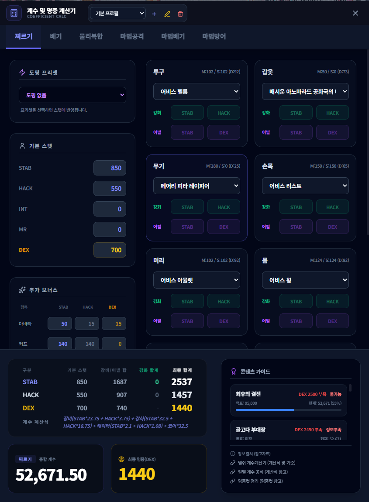

# 계수 및 명중 계산기 (Coefficient & Hit Calculator)

## 1. 기능 개요 및 목적
캐릭터의 스테이터스, 장비 정보, 도핑 상태를 종합하여 스킬 대미지에 영향을 주는 '계수'와 콘텐츠별 '명중(DEX) 컷' 통과 여부를 정밀하게 계산하는 고급 분석 도구입니다. 캐릭터의 스펙업 효율을 미리 시뮬레이션할 수 있습니다.

## 2. 주요 UI 구성 요소 설명
- **공격 타입 탭:** 찌르기(STAB), 베기(HACK), 물리복합, 마법공격, 마법베기, 마법방어 등 캐릭터의 공격 유형을 선택합니다.
- **기본 스탯 및 보너스 입력:** 캐릭터의 순수 STAT과 아바타, 커프, 효과, 렐릭, 칭호 등 각종 추가 보너스 수치를 입력합니다.
- **장비 세팅 그리드:** 투구, 갑옷, 무기 등 9개 부위의 장비 정보와 강화(MAIN/SUB), 어빌리티 스탯을 입력합니다.
- **최종 결과 패널:** 하단에 실시간으로 계산된 총합 계수와 최종 명중(DEX) 수치를 큰 폰트로 표시합니다.
- **콘텐츠 가이드:** 현재 명중 수치로 진입 가능한 콘텐츠와 부족한 수치를 가이드라인으로 제시합니다.

## 3. 세부 기능 및 작동 방식
- **공격 타입별 공식 적용:** 선택한 공격 타입에 따라 계수 계산 공식(예: 찌르기 = STAB * 2.1 + DEX * 1.2 등)이 자동으로 변경됩니다.
- **장비 프로필 관리:** 여러 캐릭터나 세팅을 비교할 수 있도록 프로필 저장/불러오기 기능을 제공합니다.
- **도핑 연동:** '버프 백과'에서 설정한 프리셋 정보를 가져와 스탯에 즉시 반영할 수 있습니다.
- **실시간 시뮬레이션:** 수치를 변경할 때마다 최종 계수와 명중률이 즉시 갱신되어 스펙업 지점을 파악하기 용이합니다.

## 4. 데이터 출처
- **참고 자료:** 텔쥐 계수계산기(Google Sheets), 디시인사이드 테일즈위버 갤러리 명중컷 정리 자료
- **계산 로직:** `src/coefficient-calculator-renderer.ts` 내의 연산 공식

## 5. 스크린샷

