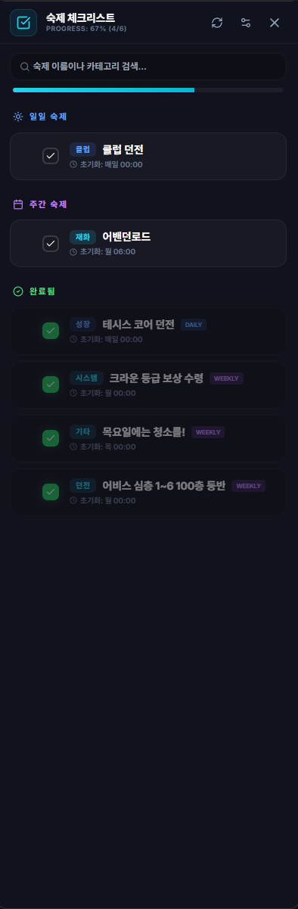

# 숙제 체크리스트 (Contents Checker)

## 1. 기능 개요 및 목적
테일즈위버의 일일 및 주간 반복 콘텐츠(일명 '숙제')를 체계적으로 관리하고 완료 여부를 추적하는 도구입니다. 초기화 시간에 맞춰 상태가 자동으로 리셋되며, 진행 상황을 시각적인 프로그레스 바와 사운드 피드백으로 제공하여 놓치는 콘텐츠가 없도록 돕습니다.

## 2. 주요 UI 구성 요소 설명
- **프로그레스 바 (Progress Bar):** 현재 활성화된 전체 숙제 중 완료된 비율을 실시간으로 표시합니다.
- **검색 박스 (Search Box):** 숙제 이름이나 카테고리명을 통해 특정 항목을 빠르게 찾을 수 있습니다.
- **콘텐츠 카드 (Item Card):** 각 숙제의 이름, 카테고리, 초기화 정보를 표시합니다. 클릭 시 완료 상태가 토글됩니다.
- **관리 모드 (Edit Mode):** 숙제의 순서 변경(드래그 앤 드롭), 숨기기, 이름 수정, 커스텀 숙제 추가가 가능한 모드입니다.
- **추가 폼 (Add Form):** 사용자가 직접 관리하고 싶은 새로운 숙제를 이름, 카테고리, 초기화 규칙(매일/매주)과 함께 등록합니다.

## 3. 세부 기능 및 작동 방식
- **자동 초기화 시스템:** 설정된 초기화 시간(예: 매일 00:00, 매주 목요일 00:00 등)이 지나면 완료 상태가 자동으로 해제됩니다.
- **드래그 앤 드롭 정렬:** 관리 모드에서 숙제 카드를 원하는 순서대로 배치하여 우선순위를 조정할 수 있습니다.
- **그룹별 사운드 피드백:** 일일 또는 주간 숙제 그룹을 100% 달성할 경우 특별한 효과음이 재생되어 성취감을 부여합니다.
- **유연한 숨김 기능:** 현재 수행하지 않는 콘텐츠는 삭제 대신 '숨김' 처리를 통해 리스트에서 제외할 수 있습니다.

## 4. 데이터 출처
- **설정 및 상태 데이터:** `main` 프로세스의 `config` 데이터 및 `contentsCheckerItems` 배열
- **효과음:** `src/assets/sound/` (voice_wow.wav, max_affection.wav 등)

## 5. 스크린샷

