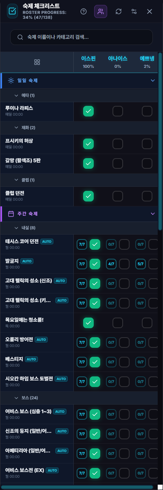
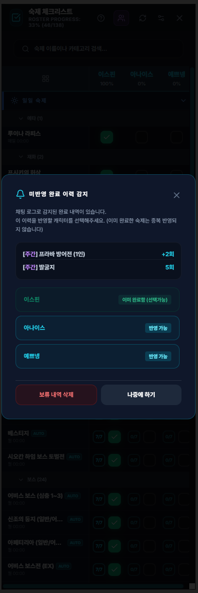

# 숙제 체크리스트 (Contents Checker)

## 1. 기능 개요 및 목적
테일즈위버의 일일 및 주간 반복 콘텐츠(일명 '숙제')를 효율적으로 관리하고 완료 여부를 실시간으로 추적하는 도구입니다. 리셋 주기에 맞춰 완료 상태가 자동으로 초기화되며, 진행 상황을 시각적인 프로그레스 바와 성취감을 주는 사운드 피드백으로 제공합니다.

## 2. 주요 UI 구성 요소 및 조작 방식
- **다중 캐릭터 관리 & Matrix View (바둑판 보기):** 
  - 캐릭터별로 독립적인 숙제 완료 여부를 기록할 수 있는 캐릭터 프리셋이 제공됩니다.
  - **Matrix View** 모드로 전환하면 모든 등록 캐릭터의 숙제 진행 상태를 거대한 바둑판 형태로 한눈에 조망할 수 있으며, 가로폭이 넓은 경우 `Shift + 마우스 휠` 단축키를 사용해 가로 스크롤이 가능합니다.
- **캐릭터별 진행도 필터링(N/A):**
  - 특정 캐릭터가 플레이하지 않는 숙제의 경우, 완료 횟수 카운터를 클릭해 `N/A` (회색 배경) 상태로 지정할 수 있습니다.
  - N/A로 지정된 숙제는 해당 캐릭터의 개인 완료율(%) 분모 계산에서 제외되어 정확한 진행 상황을 렌더링해 줍니다.
- **프로그레스 바 (Progress Bar):** 현재 활성화된 전체 숙제 중 완료된 비율을 실시간으로 표시합니다.
- **검색 박스 (Search Box):** 숙제 이름이나 카테고리명을 통해 특정 항목을 빠르게 찾을 수 있습니다.
- **콘텐츠 카드 및 마우스 조작 (v1.13.3 개편):** 단순 체크 방식에서 벗어나 횟수를 조작할 수 있는 카운터형 컴포넌트(예: 0/7)가 적용되었습니다.
  - **마우스 좌클릭:** 완료 횟수를 `+1` 증가시킵니다. (최대 완료 횟수 도달 시 초록색 카드로 표시되며 완료 처리됩니다.)
  - **마우스 우클릭:** 완료 횟수를 `-1` 감소시킵니다.
  - **체크박스 토글:** 카운터 우측의 체크박스를 클릭하여 즉시 `100% 완료` 상태로 전환하거나 완료 상태를 완전히 해제할 수 있습니다.
- **관리 모드 (Edit Mode):** 숙제의 순서 변경(드래그 앤 드롭), 숨기기, 이름 수정, 커스텀 숙제 추가/삭제 및 최대 횟수(`maxCount`) 수정이 가능합니다.
- **추가/수정 폼:** 새로운 숙제를 등록하거나 기존 설정을 수정할 수 있습니다. 이름, 카테고리, 초기화 규칙(매일/매주), 그리고 주간 숙제의 경우 최대 완료 필요 횟수(`maxCount`)를 직접 지정할 수 있습니다.

## 3. 세부 기능 및 작동 방식
- **실시간 자동 완료 체크 엔진 (v1.13.4 신설):**
  채팅 로그 파싱을 통해 콘텐츠 클리어를 인게임 플레이 중 실시간으로 감지합니다. 보스 처치나 던전 완료 메시지가 출력되면 숙제 완료 횟수가 **자동으로 카운트업**됩니다.
  - **대상 목록:** `베스티지`, `아페티리아 (일반/어려움)`, `이클립스 (에토스/마티아/티로로스/라이코스/체리아/셀피나)`, `머큐리얼 보스`, `어비스/머큐리얼 코어 마스터`, `신조의 둥지 (일반/어려움)`, `테시스 코어 던전`, `프라바 방어전 (1인)`, `지하요새의 망령` 등 약 20여 종 연동.
  - **오를리 방어전 지옥 난이도 감지**: 지옥 난이도 클리어 시스템 메시지를 감지하여 주간 숙제 카운팅을 자동으로 올리고 `AUTO` 배지를 띄워 줍니다.
  - **클럽던전 추가**: 기본 일일 숙제 목록에 '클럽던전'이 정식으로 신설되었습니다.
- **주간화 및 초기화 시스템:** 주간 콘텐츠의 경우 테일즈위버의 공식 초기화 규칙에 부합하게 **매주 월요일 오전 00:00**에 자동으로 완료 상태 및 횟수가 리셋됩니다.
- **게임 종료 리마인더 다중 캐릭터 고도화:**
  - 테일즈위버가 강제 또는 정상 종료될 때 뜨는 안내 모달에 숙제 완료를 완료하지 못한 **모든 캐릭터의 명단과 각 캐릭터별 밀린 숙제 목록**을 아이콘 배지와 함께 한눈에 렌더링하여 당일의 숙제 루틴을 상기시켜 줍니다.
- **최대 횟수 변경 시 자동 맞춤 보정:** 숙제의 최대 수행 횟수를 수정할 때, 기존에 이미 누적된 캐릭터별 완료 횟수가 수정된 최대치보다 크면 한도를 초과하지 않도록 완료 횟수를 최대치에 맞춰 안전하게 자동 보정합니다.
- **드래그 앤 드롭 정렬:** 관리 모드에서 숙제 카드를 원하는 순서대로 배치하여 우선순위를 조정할 수 있습니다.
- **그룹별 사운드 피드백:** 일일 또는 주간 숙제 그룹을 100% 달성할 경우 특별한 효과음이 재생됩니다.

## 4. 데이터 출처
- **설정 및 상태 데이터:** `main` 프로세스의 `config` 데이터 및 `contentsCheckerItems` 배열 (`contents.json`)
- **실시간 로그 트리거:** `chatLogProcessor.ts` 및 `chatParser.ts`를 통해 파싱된 클리어 이벤트.
- **효과음:** `src/assets/sound/` (voice_wow.wav, max_affection.wav 등)

## 5. 스크린샷

