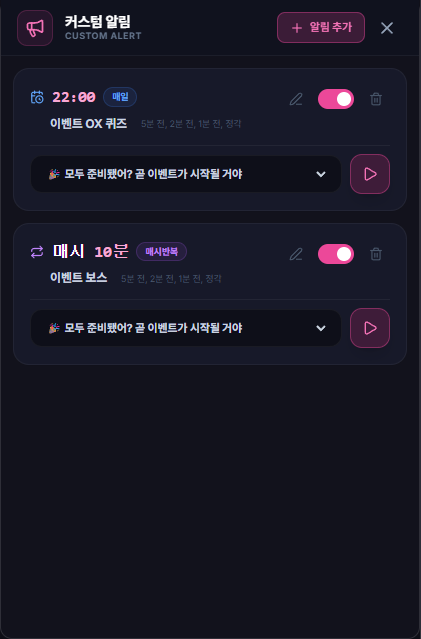

# 커스텀 알림 (Custom Alert)

## 1. 기능 개요 및 목적
필드보스 알림 외에 사용자가 직접 정의한 특정 시각(매일) 또는 특정 분(매시)에 알림을 받을 수 있는 범용 알림 시스템입니다. 정기적인 이벤트(예: 룬 정원 보너스, 특정 시간 던전 등)나 개인적인 일정을 관리하는 데 유용합니다.

## 2. 주요 UI 구성 요소 설명
- **알림 타입 선택 탭:** '매일 특정 시각' 또는 '매시 특정 분' 반복 알림 중 선택할 수 있습니다.
- **목표 시각/분 입력:** 알림이 발생할 구체적인 시각(HH:mm) 또는 분(0~59)을 설정합니다.
- **메시지 입력 창:** 알림 발생 시 화면에 표시될 커스텀 메시지를 작성합니다.
- **알림 시점 선택:** 정각뿐만 아니라 10분 전, 5분 전 등 사전 알림 시점을 다중 선택할 수 있습니다.
- **사운드 선택 및 미리보기:** 알림 발생 시 재생될 사운드를 선택하고 즉시 들어볼 수 있습니다.
- **알림 리스트:** 등록된 모든 알림을 카드로 표시하며 개별 활성화/비활성화, 수정, 삭제가 가능합니다.

## 3. 세부 기능 및 작동 방식
- **다양한 반복 로직:** 매일 정해진 시간에 발생하는 일회성 알림과 매시간 특정 분마다 반복되는 주기적 알림을 모두 지원합니다.
- **지능형 오프셋 알림:** 하나의 설정으로 정각 포함 최대 5개의 시점에 알림을 받을 수 있습니다.
- **사운드 및 메시지 매칭:** 각 알림마다 독립적인 사운드와 메시지를 설정하여 소리만으로도 어떤 알림인지 식별할 수 있습니다.
- **실시간 적용:** 저장 즉시 백그라운드 폴링 루프에 반영되어 즉각적인 알림 대기 상태가 됩니다.

## 4. 데이터 출처
- **사용자 설정:** `main` 프로세스의 `config` 내 `customAlerts` 배열
- **알림 사운드:** `src/assets/sound/` 내 오디오 파일 목록

## 5. 스크린샷

