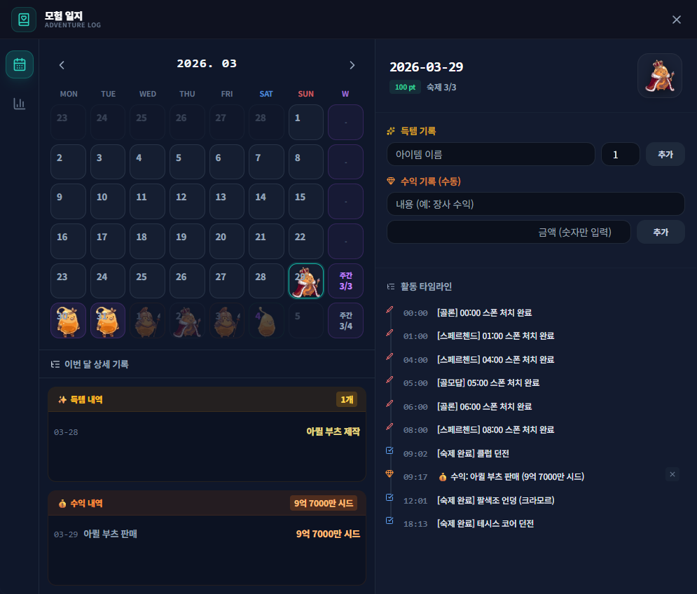
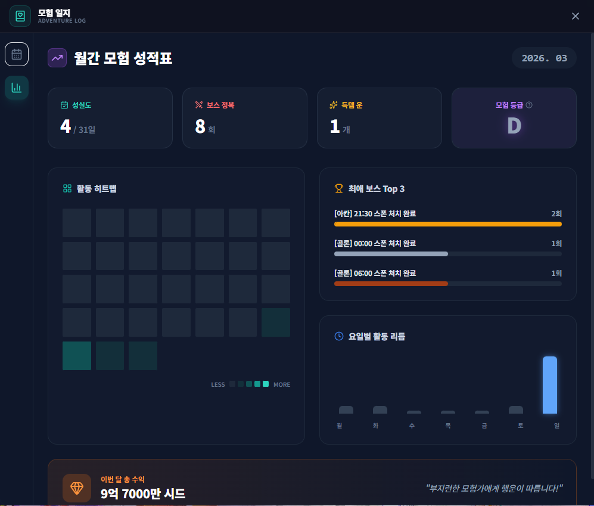

# 모험 일지 (Adventure Log)

## 1. 기능 개요 및 목적
사용자의 게임 내 활동(보스 처치, 숙제 완료, 득템, 수익 등)을 자동으로 기록하고 통계화하여 보여주는 종합 활동 로그 시스템입니다. 달력 형태의 UI를 통해 매일의 성실도를 체크하고 월간 리포트를 통해 성장 과정을 한눈에 파악할 수 있습니다.

## 2. 주요 UI 구성 요소 설명
- **활동 기록 탭 (Calendar View):** 
  - **달력 그리드:** 날짜별 활동 점수에 따라 색상이 변하고 성장 단계별 몬스터 아이콘이 표시됩니다.
  - **이달의 요약:** 월간 총 득템 개수와 수익(Seed) 합계를 표시합니다.
  - **타임라인:** 선택한 날짜의 상세 활동 내역을 시간순으로 보여줍니다.
- **통계 리포트 탭 (Stats View):**
  - **성적표 카드:** 출석일수, 보스 처치수, 득템수 및 종합 '모험 등급(S~D)'을 표시합니다.
  - **활동 히트맵:** 한 달간의 활동 밀도를 시각화하여 보여줍니다.
  - **요일별 리듬:** 어느 요일에 가장 활발하게 활동했는지 그래프로 표시합니다.

## 3. 세부 기능 및 작동 방식
- **활동 점수 시스템:** 활동 양과 종류에 따라 점수가 누적되며, 이에 따라 달력의 몬스터가 알에서 최종 단계까지 진화합니다.
- **자동/수동 기록 병행:** 보스 알림 클릭이나 숙제 체크는 자동으로 기록되며, 득템이나 기타 수익은 사용자가 직접 수동으로 입력할 수 있습니다.
- **지능형 통계 산출:** 누적된 DB 데이터를 분석하여 월간 성과를 등급화하고 요일별 패턴을 도출합니다.
- **시드(Seed) 단위 변환:** 큰 수치의 수익을 '억', '만' 단위로 자동 변환하여 가독성을 높였습니다.

## 4. 데이터 출처
- **로컬 데이터베이스:** `diary.db` (SQLite)
- **아이콘 에셋:** `src/assets/monster/` (진화 단계별 이미지)

## 5. 스크린샷

