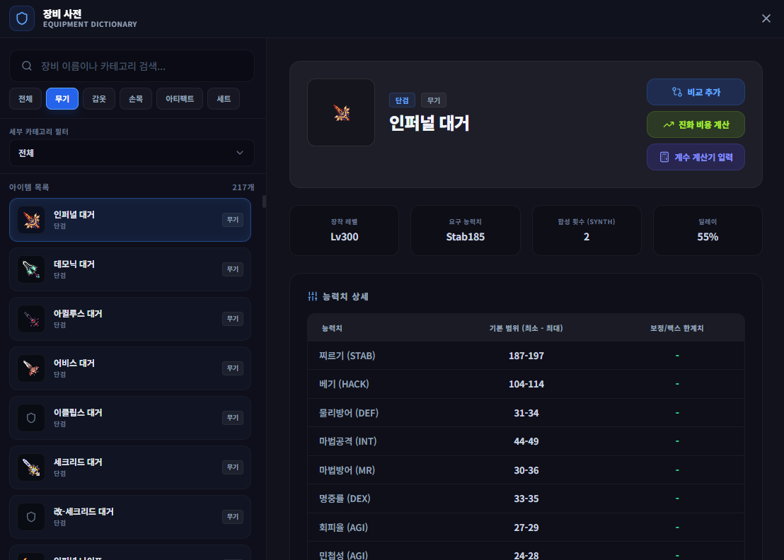
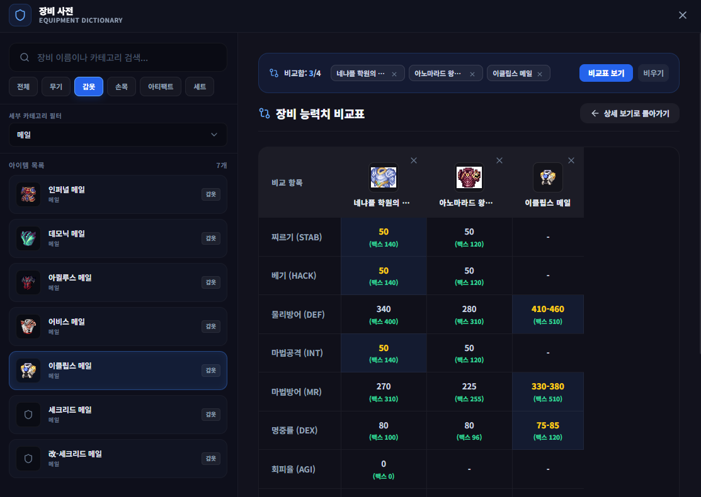

# 장비 사전 (Equipment Dictionary)

## 1. 기능 개요 및 목적
게임 내 모든 장비(무기, 갑옷, 손목, 아티팩트, 세트 아이템 및 어빌리티)의 스펙 및 기본 능력치 범위, 보정 맥스 한계치, 장착 레벨 및 스탯 요구사항을 직관적으로 확인하고 비교할 수 있는 가이드 도구입니다.

## 2. 주요 UI 구성 요소 설명
- **좌측 검색 및 목록 패널:** 
  - **검색창:** 장비명 또는 카테고리명을 검색할 수 있으며 한글 초성 검색을 지원합니다.
  - **대분류 탭:** 전체, 무기, 갑옷, 손목, 아티팩트, 세트 아이템 유형을 빠르게 선택합니다.
  - **세부 카테고리 필터:** 대분류 하위의 상세 파트(예: 메일, 로브, 암릿 등)를 커스텀 드롭다운으로 검색 및 필터링할 수 있습니다.
- **우측 상세 정보 패널:** 
  - **아이템 카드:** 선택된 장비의 이미지, 등급, 부위, 설명 및 메타 정보(장착 레벨, 요구 스탯, 합성 횟수, 딜레이)를 보여줍니다.
  - **능력치 상세 테이블:** 장비의 기본 드롭 범위(최소-최대)와 보정 한계 맥스(Max) 수치를 그리드로 표기합니다.
  - **어빌리티 상세 뷰:** 선택한 아이템이 어빌리티인 경우, 슬롯 요구량과 기본 효과 및 추가 효과 옵션 텍스트를 제공합니다.
- **상단 비교 표시줄 및 비교표 뷰:** 
  - **비교함 장바구니:** 최대 4개의 장비를 임시 보관함에 담을 수 있습니다.
  - **비교표 대조 매트릭스:** 장바구니에 담긴 장비들을 가로 행렬로 배치하여 비교합니다. 각 능력치 항목 중 가장 높은 값은 **금색 텍스트와 하이라이트 배경**으로 강조되어 스펙 차이를 시각적으로 구별해 줍니다.

## 3. 세부 연동 기능
- **계수 계산기 입력:** 
  - 상세 패널의 「계수 계산기 입력」 버튼을 누르면 계수 계산기의 해당 장비 부위(투구, 갑옷, 무기 등) 드롭다운에 이 장비 정보가 실시간 주입되어 장착됩니다.
  - 계산기에 기존 수록되지 않았던 가상 장비여도 사전 스펙을 파싱해 임시 옵션으로 생성하여 장착하고 대미지 계수 연산에 즉각 반영합니다.
- **진화 비용 계산:** 
  - 진화가 가능한 세트 장비(아카드, 엔키라, 인퍼널, 아퀼루스, 어비스, 이클립스 등)인 경우 「진화 비용 계산」 버튼이 제공됩니다.
  - 클릭 시 진화 계산기 창이 열리고 해당 장비의 카테고리(무기/장비) 및 부위와 진화 체인 상의 레벨 단계가 자동으로 세팅되어 즉시 진화 필요 재화를 계산할 수 있습니다.

## 4. 데이터 및 소스 정보
- **로컬 데이터:** `src/assets/data/equipment_dic.json`
- **검색 엔진:** 초성 탐색 알고리즘 (`src/utils/hangul.ts`)

## 5. 스크린샷

