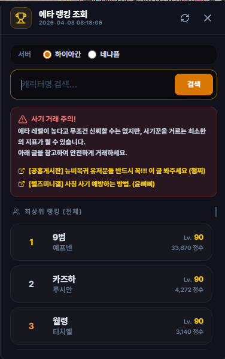

# 에타 랭킹 조회 (Eta Ranking Inquiry)

## 1. 기능 개요 및 목적
테일즈위버 공식 홈페이지에서 제공하는 '에타의 의지' 랭킹 정보를 앱 내에서 간편하게 조회하는 기능입니다. 캐릭터의 레벨과 정수 수치를 확인하여 자신의 위치를 파악하거나, 거래 상대방의 정보를 확인하여 사기 피해를 예방하는 지표로 활용할 수 있습니다.

## 2. 주요 UI 구성 요소 설명
- **서버 선택 라디오 버튼:** 하이아칸, 네냐플 서버 중 조회 대상을 선택합니다.
- **캐릭터명 검색 창:** 특정 캐릭터의 닉네임을 입력하여 랭킹 정보를 검색합니다.
- **사기 주의 안내 배지:** 안전한 거래를 위한 공지사항 및 커뮤니티 가이드 링크를 제공합니다.
- **랭킹 리스트:** 순위, 닉네임, 캐릭터 타입, 레벨, 누적 정수를 리스트 형태로 표시합니다.
- **새로고침 버튼:** 최신 랭킹 데이터로 즉시 업데이트합니다.

## 3. 세부 기능 및 작동 방식
- **공식 API 연동:** 테일즈위버 공식 홈페이지의 랭킹 데이터를 실시간으로 가져와 파싱합니다.
- **순위별 시각화:** 1~3위 상위 랭커에게는 금, 은, 동 색상의 강조 효과를 부여합니다.
- **거래 안전 가이드:** 랭킹 조회와 함께 사칭 및 사기 예방 방법을 안내하여 사용자의 안전한 게임 이용을 돕습니다.
- **지능형 로딩 상태:** 데이터 요청 중에는 애니메이션 효과와 함께 입력 필드를 비활성화하여 중복 요청을 방지합니다.

## 4. 데이터 출처
- **외부 API:** 테일즈위버 공식 홈페이지 랭킹 데이터 (Proxy 통신)
- **참고 링크:** 테일즈위버 자유게시판 및 미니 갤러리 사기 예방 가이드

## 5. 스크린샷

