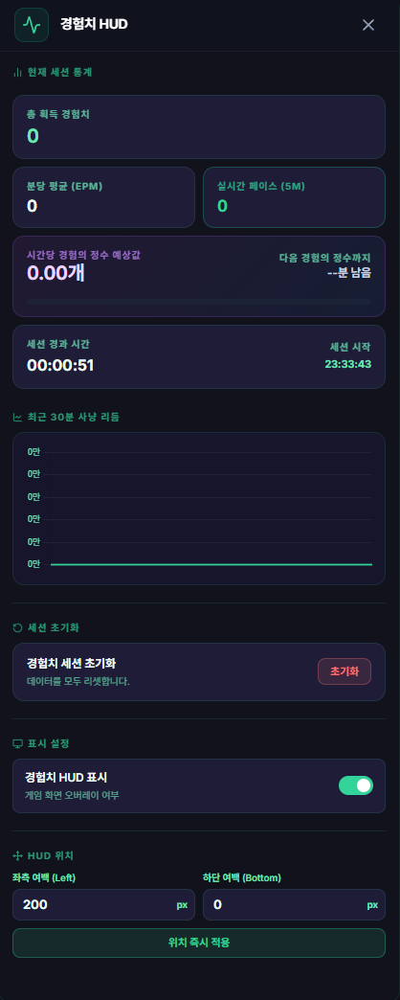

# 실시간 경험치 HUD (Experience HUD)

## 1. 기능 개요 및 목적
사냥 중 획득하는 경험치를 실시간으로 추적하여 시각화해주는 고성능 대시보드입니다. 단순히 수치만 보여주는 것을 넘어, 사냥 리듬을 분석하고 미래의 성과(경험의 정수 획득 시점 등)를 예측하여 효율적인 사냥을 돕습니다.

## 2. 주요 UI 구성 요소 설명
- **경험치 획득량 & EPM:** 실시간으로 올라가는 누적 경험치와 분당 획득 경험치(EPM)를 표시합니다.
- **사냥 리듬 차트 (Chart.js):** 최근 30분간의 경험치 획득 추이를 선 그래프로 보여줍니다. 사냥 집중도가 떨어지는 시점을 직관적으로 파악할 수 있습니다.
- **몬스터 킬 카운터 (Monster Kill Counter):** 이번 사냥 세션 동안 잡은 몬스터 수량과 마리당 평균 획득 경험치(Average XP)를 실시간으로 집계해 사냥터 효율을 비교합니다.
- **경험의 정수 예측기 및 세션 교환 수:**
  - 현재 사냥 페이스를 기준으로 100억 경험치(경험의 정수 1개)를 모으는 데 걸리는 예상 시간과 기대량을 계산합니다.
  - 당일 세션 내 실제 교환된 정수 개수(100억 차감 횟수)를 제공하며, 정수 교환 즉시 진행도 게이지바가 0%로 리셋되어 다시 차오르는 세부 동작을 취합니다.
- **포커스 모드 위젯:** 게임 화면 위 아주 작은 영역만 차지하는 초소형 위젯으로 전환하여 핵심 수치만 모니터링할 수 있습니다.

## 3. 세부 기능 및 작동 방식
- **실시간 데이터 피드:** [실시간 로그 엔진](./realtime-log-engine.md)으로부터 발행되는 경험치 획득 이벤트를 즉시 수신하여 UI를 갱신합니다.
- **경험의 정수 버프 미감지 경고:**
  - 100억 경험치 교환 한도를 초과해 110억 이상이 누적되었으나 정수 교환 로그(-100억)가 정상 기록되지 않는 경우(버프 미복용 상태), 화면 중앙에 붉은색 알림 오버레이와 경보음을 발생시켜 손실을 예방합니다.
- **통찰의 비약 타이머 연동:** 사냥 시 복용하는 통찰의 비약(대: 5분, 특대: 1분) 사용 로그를 감지해 HUD 및 버프 타이머 위젯에 실시간 남은 시간을 이미지와 함께 매핑합니다.
- **이동 평균(Moving Average) 알고리즘:** 일시적인 획득량 변화에 수치가 급격히 튀지 않도록 이동 평균 기법을 적용하여 안정적인 페이스 지표를 제공합니다.
- **데이터 연속성 보장:** HUD 창을 닫아도 통계 데이터를 계속 백그라운드 관리하므로, 창을 다시 열었을 때 끊김 없는 차트와 통계를 즉시 복구합니다.
- **지능형 단위 스케일링:** '조/억/만' 단위를 사용하여 천문학적으로 높은 테일즈위버의 경험치 수치를 가독성 높게 포맷팅합니다.

## 4. 데이터 출처
- **트리거:** 실시간 로그 엔진의 경험치 및 버프 파싱 이벤트.
- **관리 주체:** `src/modules/chatLogProcessor.ts` (메인 통계 로직).

## 5. 스크린샷

*(게임 화면 우측 상단에 자석처럼 붙는 경험치 위젯 및 HUD 상세 화면)*
