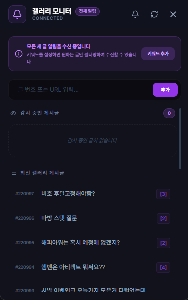

# 갤러리 모니터 (Gallery Monitor)

## 1. 기능 개요 및 목적
디시인사이드 테일즈위버 갤러리의 최신 게시글을 실시간으로 모니터링하는 도구입니다. 특정 키워드가 포함된 글이 올라오면 알림을 주거나, 관심 있는 글의 댓글 수 변화를 추적하여 중요한 정보나 거래 글을 놓치지 않게 도와줍니다.

## 2. 주요 UI 구성 요소 설명
- **알림 토글 및 키워드 배지:** 전체 새 글 알림을 받을지, 특정 키워드만 필터링할지 상태를 표시하고 제어합니다.
- **감시 입력 창:** 특정 게시글의 번호나 URL을 입력하여 댓글 모니터링 대상으로 추가합니다.
- **감시 중인 게시글 리스트:** 현재 댓글 수를 추적 중인 글들을 보여주며, 댓글 수 증가 시 시각적인 피드백을 제공합니다.
- **최신 갤러리 리스트:** 갤러리의 실시간 최신 글 목록을 보여줍니다.
- **로딩 오버레이:** 데이터 새로고침 중에는 진행 상태를 시각화하여 보여줍니다.

## 3. 세부 기능 및 작동 방식
- **실시간 백그라운드 크롤링:** `main` 프로세스에서 주기적으로 갤러리 데이터를 확인하여 새로운 글이나 댓글 변화를 감지합니다.
- **키워드 필터링 시스템:** 사용자가 설정한 키워드가 제목에 포함된 경우에만 알림을 발생시켜 불필요한 피로도를 줄입니다.
- **게시글 감시 (Watch):** 특정 게시글을 추가하면 해당 글의 댓글 수를 지속적으로 체크하여 변화가 있을 때 알림을 줍니다.
- **인게임 브라우저 연동:** 게시글 클릭 시 앱 내 오버레이 브라우저나 외부 브라우저를 통해 즉시 해당 글로 이동할 수 있습니다.

## 4. 데이터 출처
- **외부 데이터:** 디시인사이드 테일즈위버 갤러리 게시판 데이터 (Proxy 통신)
- **사용자 설정:** `main` 프로세스의 `config` 내 갤러리 관련 설정들

## 5. 스크린샷

