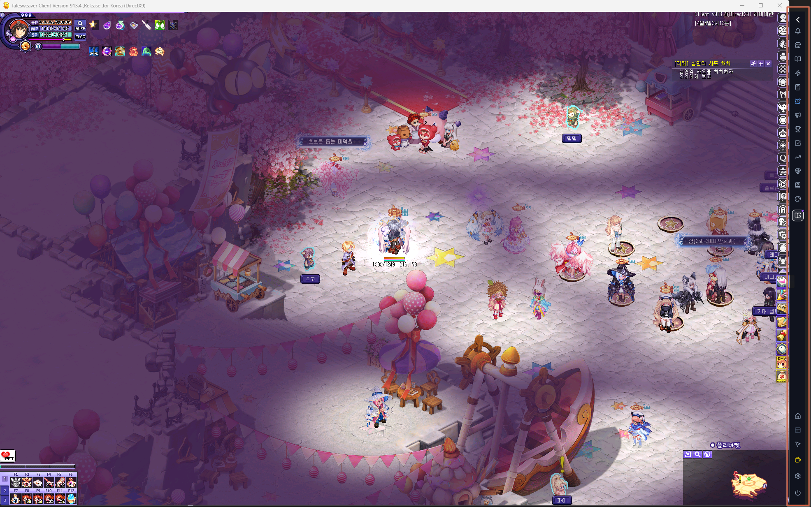

# 메인 대시보드 (Sidebar Dashboard)

## 1. 기능 개요 및 목적
TW-Overlay 앱의 핵심 컨트롤 타워 역할을 하는 사이드바 형태의 대시보드입니다. 게임 화면 옆에 상주하며 각종 계산기, 사전, 알림 시스템을 원클릭으로 호출하고 필드보스 및 커스텀 알림을 토스트 형태로 사용자에게 전달합니다.

## 2. 주요 UI 구성 요소 설명
- **사이드바 토글 버튼:** 사이드바를 접거나 펴서 게임 화면 점유를 최소화합니다.
- **동적 메뉴 영역:** 사전, 계산기, 일지 등 주요 기능을 실행하는 아이콘들로 구성됩니다.
- **퀵슬롯 영역:** 사용자가 설정한 외부 URL이나 특정 기능으로 바로 이동할 수 있는 바로가기 슬롯입니다.
- **토스트 알림 컨테이너:** 보스 출현이나 커스텀 알림 발생 시 화면 중앙 하단에 스택 형태로 알림을 표시합니다.
- **시스템 컨트롤 영역:** 환경 설정, 후원하기, 앱 종료 등 시스템 관련 버튼들이 배치되어 있습니다.

## 3. 세부 기능 및 작동 방식
- **자석형 부착 및 투명도 제어:** 게임 창 상태를 추적하여 최상위 노출 및 투명도를 자동으로 조절합니다.
- **하이브리드 알림 시스템:** 알림 발생 시 효과음 재생과 함께 토스트 알림을 띄우며, 토스트 내 버튼을 통해 즉시 '모험 일지'에 활동을 기록할 수 있습니다.
- **마우스 투과 제어:** 평상시에는 마우스 클릭이 게임 화면으로 전달되도록 투과 상태를 유지하다가, 알림이 오거나 사이드바에 마우스를 올릴 때만 상호작용이 가능하도록 자동 전환됩니다.
- **동적 메뉴 구성:** `sidebar_menus.json` 설정을 통해 메뉴 구성과 아이콘, 색상 등을 유연하게 관리합니다.

## 4. 데이터 출처
- **메뉴 설정:** `src/assets/data/sidebar_menus.json`
- **앱 설정:** `main` 프로세스에서 관리되는 전역 `config`

## 5. 스크린샷

