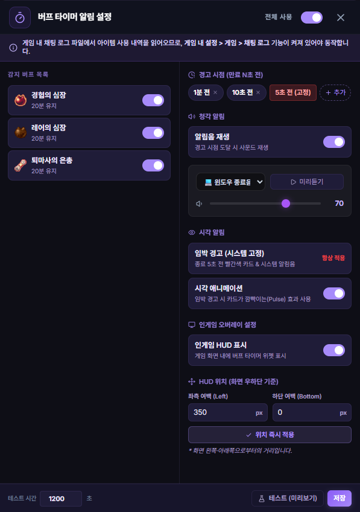

# 지능형 버프 타이머 (Intelligent Buff Timer)

## 1. 기능 개요 및 목적
사냥 효율에 결정적인 영향을 미치는 주요 버프(경험의 심장, 레어의 심장, 퇴마사의 은총 등)의 사용 여부를 실시간 로그 엔진을 통해 자동으로 감지하고, 남은 시간을 게임 화면 위에 시각화하여 보여주는 스마트 오버레이 위젯입니다.

## 2. 주요 UI 구성 요소 설명
- **버프 아이콘 뱃지:** 현재 활성화된 버프의 고유 아이콘을 게임 오버레이 영역에 표시합니다.
- **프로그레스 링:** 아이콘 테두리의 원형 게이지를 통해 남은 시간을 직관적으로 보여줍니다.
- **잔여 시간 텍스트:** 분/초 단위로 남은 시간을 정밀하게 표시합니다.
- **만료 경고 알림:** 버프 시간이 얼마 남지 않았을 때 아이콘이 깜박이거나 시스템 알림을 통해 재도핑 시점을 안내합니다.

## 3. 세부 기능 및 작동 방식
- **자동 시작 로직:** 채팅 로그에 "경험의 심장 효과가 시작되었습니다"와 같은 메시지가 찍히는 즉시 해당 버프의 지속 시간을 계산하여 타이머를 구동합니다.
- **타겟 모니터링:** 화면 가독성을 위해 사냥에 가장 필수적인 '경험/레어 심장' 및 '퇴마사' 계열 버프를 우선적으로 추적하도록 필터링되어 있습니다.
- **동적 가시성 제어:** 게임 창이 활성화(Focus)되어 있을 때만 오버레이에 노출되며, 다른 창을 사용할 때는 게임 화면을 가리지 않도록 자동으로 숨겨집니다.
- **상태 영속성:** 프로그램 재시작 시에도 마지막으로 기록된 버프 시작 시간과 지속 시간을 대조하여 남은 시간을 정확하게 복구합니다.

## 4. 데이터 출처
- **트리거:** 실시간 로그 엔진의 `BUFF_STARTED`, `BUFF_ENDED` 이벤트.
- **기준 정보:** `src/modules/buffTimerManager.ts` 내 정의된 버프별 지속 시간 명세.

## 5. 스크린샷

*(오버레이 브라우저 옆에 표시되는 버프 뱃지 예시)*
