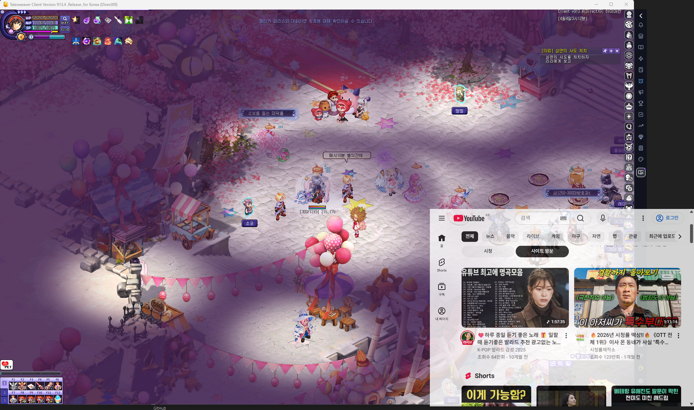

# 오버레이 제어 바 (Overlay Control Bar)

## 1. 기능 개요 및 목적
게임 화면 위에 투명하게 표시되는 인게임 브라우저(오버레이)를 제어하는 툴바입니다. 게임을 중단하지 않고 외부 웹사이트(공략, 커뮤니티 등)를 조회할 수 있도록 주소 입력, 투명도 조절, 마우스 투과 상태 확인 등의 기능을 제공합니다.

## 2. 주요 UI 구성 요소 설명
- **드래그 핸들:** 툴바 왼쪽의 아이콘을 드래그하여 오버레이 창의 위치를 이동시킵니다.
- **주소 입력 필드:** 접속하려는 웹사이트 URL을 입력하거나 검색어를 입력합니다.
- **로딩 바:** 웹페이지가 로딩되는 상태를 하단 라인의 애니메이션으로 표시합니다.
- **투명도 슬라이더:** 오버레이 창의 불투명도를 10%에서 100%까지 조절합니다.
- **상태 인디케이터 (NORMAL/PASS):** 현재 마우스 클릭이 브라우저에 먹히는지(NORMAL), 아니면 통과하여 게임으로 전달되는지(PASS) 표시합니다.

## 3. 세부 기능 및 작동 방식
- **지능형 URL 보정:** 'http'를 생략하고 입력해도 자동으로 보안 프로토콜(`https://`)을 붙여 연결합니다.
- **동적 로딩 피드백:** 페이지 로딩 시작 시 보라색 라인이 채워지며, 완료 시 부드럽게 사라집니다.
- **마우스 투과 시각화:** 단축키를 통해 마우스 투과(Click-through) 모드가 변경되면 인디케이터 색상과 텍스트가 즉시 변경되어 현재 상태를 알립니다.
- **자동 숨김 로직:** 툴바 영역에 마우스가 올라오거나 벗어날 때 `main` 프로세스와 통신하여 툴바의 상호작용 가능 여부를 제어합니다.

## 4. 데이터 출처
- **사용자 설정:** `main` 프로세스의 `config` 내 오버레이 관련 설정(투명도, 마지막 URL 등)

## 5. 스크린샷

