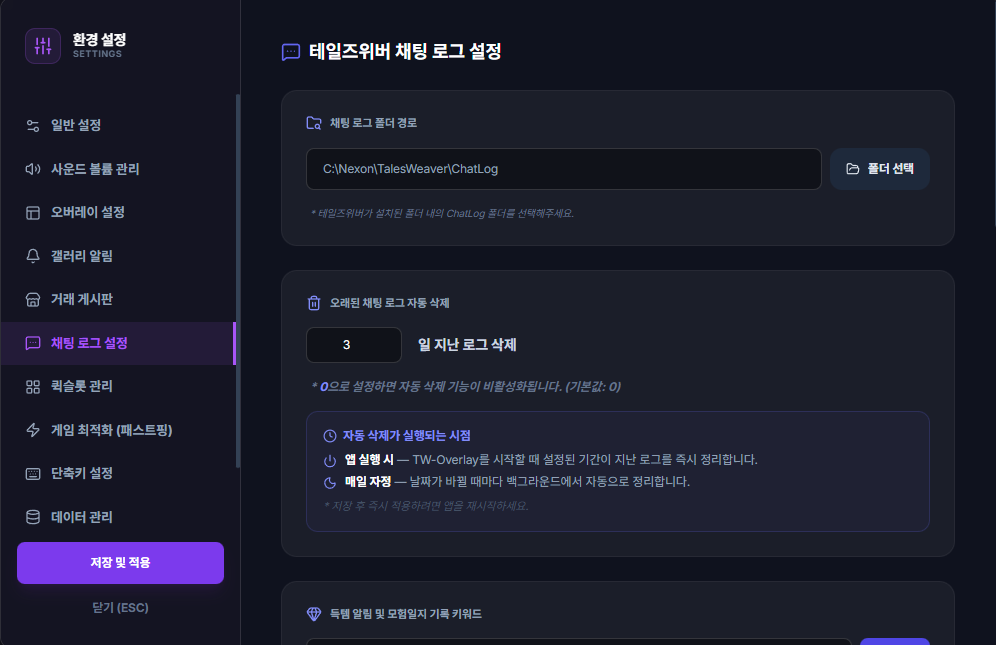

# 실시간 로그 분석 엔진 (Real-time Log Engine)

## 1. 기능 개요 및 목적
테일즈위버 게임 클라이언트가 실시간으로 생성하는 채팅 로그 파일(`ChatLog_YYYY-MM-DD.txt`)을 감시하여, 게임 내에서 발생하는 다양한 이벤트를 정밀하게 추출하는 핵심 백엔드 시스템입니다. 사용자가 수동으로 기록하지 않아도 사냥 성과(경험치, 수익, 득템)와 인게임 정보를 자동으로 수집합니다.

## 2. 주요 UI 구성 요소 설명
*본 기능은 백엔드 엔진으로 직접적인 UI는 없으나, 아래 기능들에 데이터를 공급합니다.*
- **경험치 HUD:** 실시간 경험치 획득량 및 사냥 리듬 차트 데이터 제공.
- **모험 일지:** 득템 내역 및 자동 수익 기록을 타임라인에 자동 등재.
- **외치기 히스토리:** 수집된 외치기 메시지를 검색 가능한 리스트로 표시.
- **버프 타이머:** 특정 버프 아이템 사용 메시지 감지 시 타이머 가동.

## 3. 세부 기능 및 작동 방식
- **파일 스트리밍 (Tail):** Node.js의 `tail` 모듈을 사용하여 로그 파일의 끝부분에 추가되는 내용을 실시간으로 읽어들입니다. 파일 잠김 현상을 방지하면서도 낮은 CPU 점유율을 유지합니다.
- **정규표현식 파싱:** 한국어 특유의 숫자 단위(조, 억, 만)와 아이템 획득 메시지 형식을 고도화된 Regex 패턴으로 분석하여 순수 수치 데이터로 변환합니다.
- **이벤트 기반 아키텍처:** 파싱된 데이터는 `SEED_GAINED`, `ITEM_LOOTED`, `BUFF_STARTED` 등의 이벤트로 발행되어 각 모듈로 즉시 전달됩니다.
- **데이터 영속성 및 연속성:** 10초 주기 백그라운드 타이머와 미실행 시간 보정 로직을 통해 사냥 중단 시에도 차트 데이터의 흐름을 왜곡 없이 관리합니다.

## 4. 데이터 출처
- **게임 로그:** 테일즈위버 설치 폴더 내 `ChatLog` 디렉토리의 일별 텍스트 파일.

## 5. 스크린샷

*(설정 창 내의 채팅 로그 설정 섹션)*
