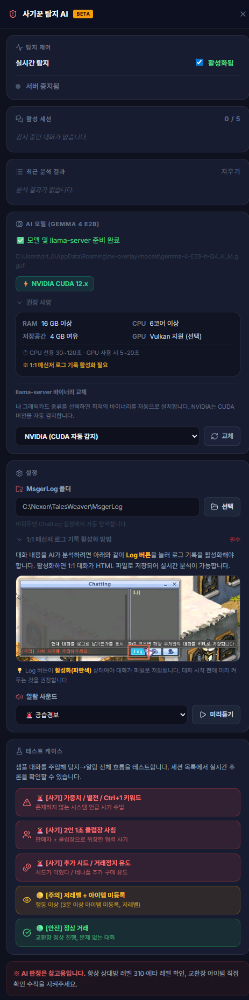

# 사기꾼 탐지 AI (Scam Detector AI)

## 1. 기능 개요 및 목적
테일즈위버 게임 내 1:1 메신저 대화에서 흔히 발생하는 다양한 사기 수법(클럽장/지인 사칭, 네냐플 추가 시드 거래 사기, 시스템 메시지 사칭 등)을 실시간으로 감지하기 위한 AI 보안 도구입니다. 개인정보 유출을 방지하기 위해 외부 서버가 아닌 **사용자의 PC에서 직접 구동되는 로컬 LLM(Gemma 4 E2B)** 추론 엔진을 탑재하여 안전하고 빠른 위협 판정을 제공합니다.

## 2. 주요 UI 구성 요소 설명
- **탐지 제어 스위치:** 실시간 대화 감시 및 AI 서버(llama-server)의 구동 여부를 제어합니다.
- **활성 세션 (Active Session) 목록:** 현재 감시 대상이 되는 개별 1:1 대화방 목록과 각 대화방의 총 메시지 수 및 실시간 판정 상태(위험 🚨, 주의 🟡, 안전 🟢, 대기중 ❓)를 실시간으로 보여줍니다.
- **실시간 스트리밍 박스:** AI가 대화 내용을 실시간으로 파싱하여 비정상 패턴 추론을 진행하는 과정을 원격 토큰 스트리밍 형태로 직접 시각화합니다.
- **최근 분석 결과 로그:** 탐지된 위험 요소들의 분석 로그 타임라인을 제공합니다.
- **테스트 케이스 패널:** 사용자가 실제 사기 상황을 테스트해 볼 수 있도록 '클럽장 사칭', '추가 시드 유도' 등 5가지 형태의 샘플 대화를 AI에 즉시 주입해 보는 시뮬레이션 환경을 제공합니다.

## 3. 세부 기능 및 작동 방식
- **Gemma 4 E2B 로컬 추론:** 구글의 초경량 고성능 언어모델 Gemma 4 E2B GGUF 모델을 PC 로컬에 탑재하여 실행합니다. 최초 실행 시 모델 데이터(~3.15 GB) 및 서버 구동 파일(~34 MB) 다운로드가 필요합니다.
- **하드웨어 가속 바인딩 (GPU/CPU):** 그래픽카드의 하드웨어 자원을 활용할 수 있도록 NVIDIA CUDA(CUDA 12.x/13.x 자동 감지) 또는 Vulkan(AMD, Intel) 컴파일 바이너리를 제공합니다. GPU 가속 시 5~20초 이내에 분석이 완료되며, CPU 단독 구동 시에는 사양에 따라 30~120초가 소요됩니다.
- **메신저 로그 연동 엔진:** 테일즈위버 클라이언트가 저장하는 1:1 메신저 로그 파일(`MsgerLog`) 디렉토리를 감시하고, 새로운 대화가 추가될 때마다 디바운싱(Debounce) 로직을 거쳐 백그라운드 AI 분석 큐에 등록하여 순차 추론합니다.

## 4. 사전 필수 설정 (매우 중요)
AI가 실시간 대화 내용을 판별하기 위해서는 게임 내에서 **메신저 로그 기록을 수동으로 켜야 합니다.**
1. 게임 내 1:1 대화창을 엽니다.
2. 대화창 오른쪽 상단의 **[Log]** 버튼을 클릭하여 파란색 **활성화 상태**로 변경합니다. (대화 시작 전에 미리 켜두어야 대화가 파일로 기록됩니다.)
3. 앱 설정의 `MsgerLog` 경로가 테일즈위버 메신저 로그 저장 디렉토리로 올바르게 설정되었는지 확인합니다.

## 5. 관련 파일
- `src/scam-detector.html` (사기꾼 탐지 AI UI)
- `src/modules/scamDetector.ts` (LLM 서버 연동, GPU/바이너리 감지, 파일 스트리밍 분석 백엔드 로직)

## 6. 스크린샷

