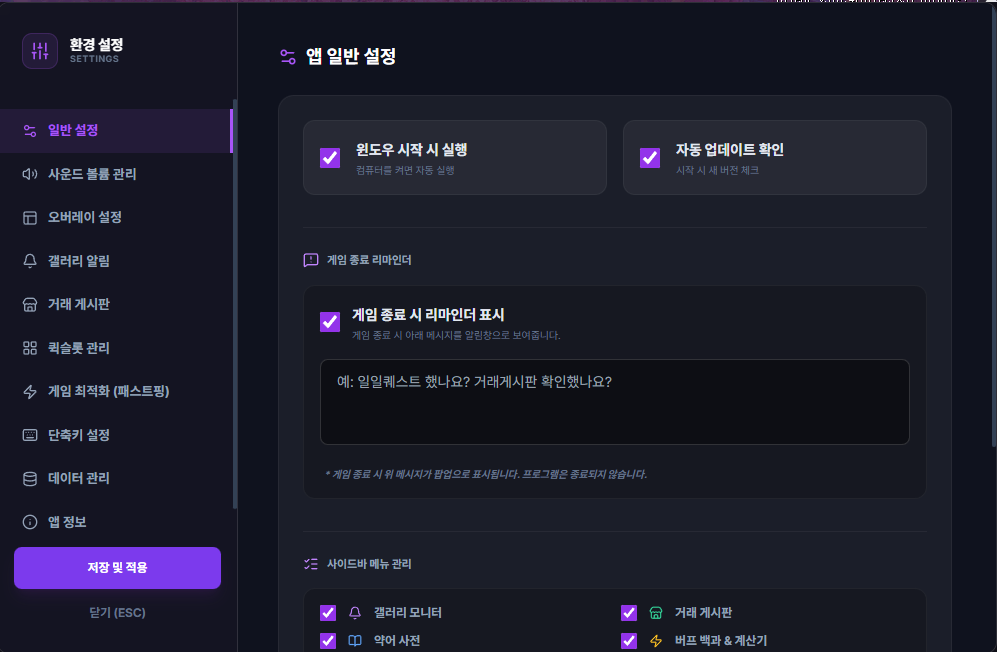

# 환경 설정 (Settings)

## 1. 기능 개요 및 목적
TW-Overlay 앱의 모든 동작 방식과 사용자 인터페이스를 개인화할 수 있는 종합 설정 센터입니다. 자동 실행부터 알림 키워드, 사운드 볼륨, 단축키, 데이터 백업까지 앱의 전반적인 환경을 관리합니다.

## 2. 주요 UI 구성 요소 설명
- **설정 사이드바:** 일반, 사운드, 오버레이, 갤러리, 거래, 퀵슬롯, 최적화 등 카테고리별 메뉴를 제공합니다.
- **메뉴 관리 그리드:** 사이드바에 표시할 아이콘들을 사용자가 직접 선택하여 숨기거나 보일 수 있게 합니다.
- **볼륨 조절 슬라이더:** 각 기능별(숙제, 계산기 등) 효과음 크기를 개별 설정하고 음소거할 수 있습니다.
- **키워드 태그 시스템:** 갤러리 및 거래 게시판 알림을 받을 키워드를 등록하고 삭제합니다.
- **단축키 레코더:** 마우스 투과 토글 등 전역 단축키를 직접 입력받아 설정합니다.
- **업데이트 가이드:** 현재 버전 확인 및 새로운 버전 다운로드/설치를 진행합니다.

## 3. 세부 기능 및 작동 방식
- **게임 최적화 (Fast Ping):** 윈도우 레지스트리를 수정하여 네트워크 패킷 지연(Nagle's Algorithm)을 제거, 게임 응답 속도를 개선합니다.
- **지능형 퀵슬롯 관리:** 드래그 앤 드롭으로 사이드바 퀵슬롯의 순서를 변경하고, 수천 개의 아이콘 라이브러리(Lucide)에서 원하는 아이콘을 검색하여 지정할 수 있습니다.
- **데이터 무결성 관리:** 설정 파일과 SQLite DB를 하나의 ZIP으로 묶어 백업하거나, 기존 백업에서 전체 복구하는 기능을 제공합니다.
- **동적 단축키 충돌 방지:** 게임 창이나 앱 창이 포커스된 상태에서만 작동하는 스마트 단축키 시스템을 채택하고 있습니다.

## 4. 데이터 출처
- **설정 저장소:** `config.json` (메인 프로세스 관리)
- **아이콘 데이터:** Lucide Icons 라이브러리
- **메뉴 데이터:** `src/assets/data/sidebar_menus.json`

## 5. 스크린샷

