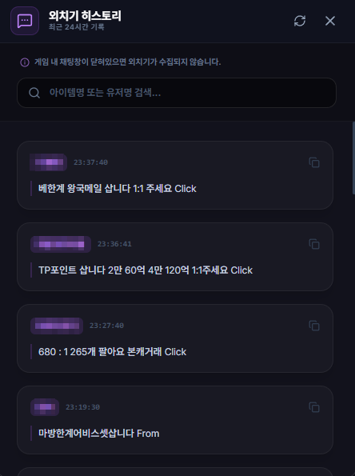

# 외치기 히스토리 (Shout History)

## 1. 기능 개요 및 목적
게임 내 '외치기' 채널의 메시지를 실시간으로 수집하여 보여주는 편의 도구입니다. 중요한 거래 정보나 파티 모집 글을 놓치지 않도록 기록하며, 수집된 메시지 내에서 원하는 키워드를 검색하거나 상대방의 닉네임을 클릭 한 번으로 복사하여 귓속말을 보내기 편하게 돕습니다.

## 2. 주요 UI 구성 요소 설명
- **검색 바 (Search Bar):** 수집된 방대한 외치기 내역 중 특정 아이템 이름이나 닉네임, 메시지 내용을 실시간으로 필터링합니다.
- **히스토리 리스트:** 외치기 시각, 발신자 닉네임, 메시지 내용을 시간 역순으로 표시합니다.
- **닉네임 원클릭 복사:** 리스트의 닉네임 영역을 클릭하면 즉시 클립보드에 복사되어 게임 내에서 `/w 닉네임`을 입력하기 용이합니다.
- **키워드 강조 및 알림:** [환경 설정](./settings.md)에서 등록한 키워드가 포함된 외치기가 발생하면 시각적으로 강조되거나 시스템 알림이 발생합니다.

## 3. 세부 기능 및 작동 방식
- **실시간 수집 로직:** [실시간 로그 엔진](./realtime-log-engine.md)이 게임 로그 파일에서 외치기 패턴을 감지하는 즉시 DB에 저장하고 UI에 반영합니다.
- **자동 데이터 정리:** 로컬 데이터베이스의 비대화를 막기 위해 **최근 24시간** 동안의 기록만 보관하며, 그 이상의 오래된 데이터는 자동으로 삭제됩니다.
- **중복 메시지 필터링:** 단시간에 반복되는 동일한 내용의 외치기를 지능적으로 관리하여 가독성을 높입니다.
- **백그라운드 감시:** 외치기 히스토리 창을 닫아두더라도 메인 프로세스에서 지속적으로 수집하므로, 창을 여는 순간 과거의 내역을 즉시 확인할 수 있습니다.

## 4. 데이터 출처
- **트리거:** 실시간 로그 엔진의 `SHOUT_DETECTED` 이벤트.
- **데이터베이스:** `diary.db` 내 `shout_history` 테이블.

## 5. 스크린샷

*(수집된 외치기 목록 및 검색 화면 예시)*
