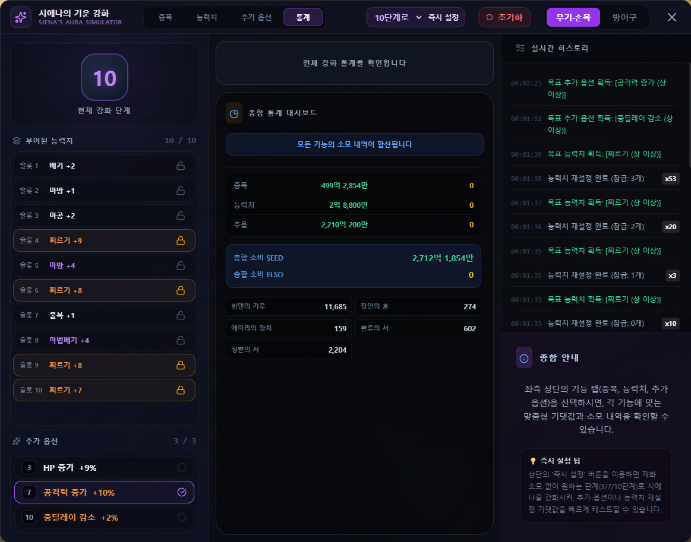

# 시에나의 기운 시뮬레이터 (Siena Aura Simulator)

## 1. 기능 개요 및 목적
테일즈위버의 특수 장비 강화 시스템인 **'시에나의 기운'**을 인게임 재화 낭비 없이 완벽하게 시뮬레이션할 수 있는 고정밀 가상 시뮬레이터입니다. 장비 증폭, 능력치 재설정, 추가 옵션 부여 등 시에나의 기운과 관련된 모든 공정을 제공하여 최적의 강화 경로와 소요 비용(엘소, 시드) 기댓값을 정밀 분석합니다.

## 2. 주요 UI 구성 요소 설명
- **증폭 (Amplification) 탭:** 장비의 등급 상승 및 증폭 단계를 강화 시뮬레이션합니다. 각 시도별 성공/실패 여부와 단계 변동을 추적합니다.
- **능력치 재설정 (Stat Reset) 탭:** 장비의 스탯 보정치(최소/최대 범위)를 변경하는 기능입니다. 
- **추가 옵션 (Additional Option) 탭:** 장비에 부여되는 추가 옵션 종류와 등급을 설정하는 영역입니다.
- **비용 통계 대시보드:** 누적 사용 시드(SEED), 엘소(Elso), 정수의 기운 등 투입된 총 재화 및 골드 환산 비용을 실시간으로 추적하여 대시보드에 표시합니다.
- **자동 재설정 (Auto Reset) 패널:** 원하는 대상 스탯(예: 찌르기 최댓값)이나 추가 옵션을 타겟으로 설정하고, 목표치에 도달할 때까지 시뮬레이션을 자동으로 빠르게 반복 구동합니다.

## 3. 세부 기능 및 작동 방식
- **독립 대시보드 및 슬롯별 비용 추적 (v1.13.1):** 탭별로 별개의 독립 대시보드가 구성되어 각 작업(증폭, 스탯 재설정 등)에 소모된 비용을 개별적으로 추적하고 합산할 수 있습니다.
- **환류 및 정환 시스템 완벽 구현:** 게임 내 메커니즘인 '환류의 기운'(비용 보정 및 등급 유지)과 '정환의 기운'의 특성을 시뮬레이터에 정확히 모델링하여, 실제와 오차 없는 비용 기댓값을 계산합니다.
- **자동 강화 및 시뮬레이션 속도 제어:** 유휴 시간 없이 목표 조건 달성 시까지 초고속으로 자동 시뮬레이션을 진행할 수 있으며, 강화 기댓값 리포트를 통해 목표 도달에 필요한 평균 시도 횟수와 예상 비용을 가이드합니다.

## 4. 데이터 출처
- **시뮬레이션 공식 및 확률:** 테일즈위버 인게임 시에나의 기운 강화 공식 및 공개된 성공 확률 기반.
- **관련 파일:**
  - `src/siena-aura.html` (시뮬레이터 프론트엔드 UI)
  - `src/siena-aura-renderer.ts` (확률 엔진 및 대시보드 렌더링 로직)

## 5. 스크린샷

