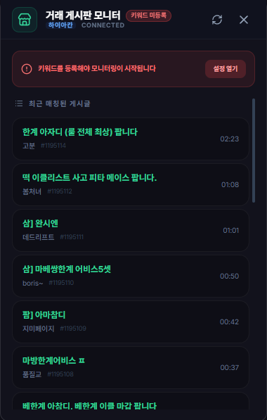

# 거래 게시판 모니터 (Trade Monitor)

## 1. 기능 개요 및 목적
테일즈위버 최대 커뮤니티인 '매직위버'의 아이템 거래 게시판을 실시간으로 모니터링하는 도구입니다. 원하는 아이템 이름을 키워드로 등록해두면, 해당 아이템의 매물이 올라왔을 때 즉시 알림을 주어 빠른 거래를 돕습니다.

## 2. 주요 UI 구성 요소 설명
- **서버 및 키워드 상태 배지:** 현재 감시 중인 서버(하이아칸/네냐플)와 등록된 키워드 개수를 표시합니다.
- **키워드 가이드 배너:** 키워드가 등록되지 않았을 때 모니터링 시작 방법을 안내합니다.
- **매칭 게시글 리스트:** 등록한 키워드가 제목에 포함된 최신 게시글들을 시간순으로 보여줍니다.
- **로딩 오버레이:** 수동 새로고침 시 데이터 수집 상태를 애니메이션으로 표시합니다.

## 3. 세부 기능 및 작동 방식
- **주기적 백그라운드 체크:** 매 5분마다 선택된 서버의 거래 게시판을 확인하여 새로운 매물을 검색합니다.
- **키워드 하이라이팅:** 검색된 글 목록에서 아이템 이름을 강조하여 가독성을 높였습니다.
- **중복 알림 방지:** 이미 확인했거나 알림이 나간 게시글은 중복으로 알리지 않도록 처리되어 있습니다.
- **원클릭 이동:** 게시글 클릭 시 해당 거래글의 URL로 즉시 이동하여 내용을 확인할 수 있습니다.

## 4. 데이터 출처
- **외부 데이터:** 네이버 카페 '매직위버' 거래 게시판 (Proxy 통신)
- **사용자 설정:** 환경 설정 내 '거래 게시판' 섹션의 키워드 및 서버 정보

## 5. 스크린샷

