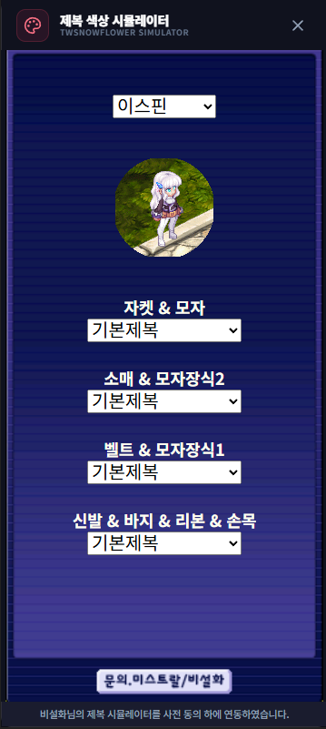

# 제복 색상 시뮬레이터 (Uniform Color Simulator)

## 1. 기능 개요 및 목적
캐릭터의 제복 염색 색상을 미리 시뮬레이션해볼 수 있는 외부 도구(비설화 님의 시뮬레이터)를 앱 내에서 간편하게 사용할 수 있도록 통합한 기능입니다. 복잡한 염색약 사용 전에 최종 결과물을 미리 확인하여 실패 없는 코디를 지원합니다.

## 2. 주요 UI 구성 요소 설명
- **통합 헤더:** 앱의 다른 창들과 일관된 디자인의 드래그 가능한 헤더를 제공합니다.
- **시뮬레이터 영역:** 비설화 님의 `twsnowflower` 웹 서비스가 임베디드되어 나타나는 영역입니다.
- **크레딧 푸터:** 외부 도구 제작자에 대한 정보와 연동 동의 문구를 표시합니다.

## 3. 세부 기능 및 작동 방식
- **웹 뷰 임베딩:** `WebContentsView`를 사용하여 외부 웹 서비스를 앱의 일부처럼 매끄럽게 렌더링합니다.
- **전용 창 관리:** 사이드바 메뉴를 통해 독립된 창으로 실행되며, 게임 화면 옆에 띄워두고 실시간으로 색상을 비교하며 염색을 진행할 수 있습니다.
- **상호작용 지원:** 마우스 클릭과 스크롤을 통해 웹 시뮬레이터의 모든 기능을 제어할 수 있습니다.

## 4. 데이터 출처
- **외부 서비스:** [비설화 님의 제복 시뮬레이터](https://twsnowflower.github.io/) (사전 동의 하에 연동)

## 5. 스크린샷

