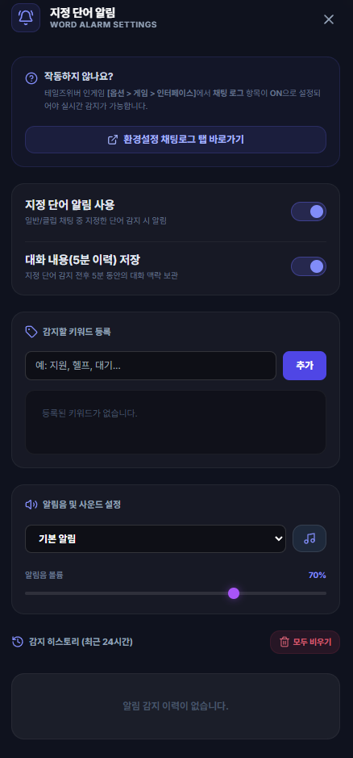

# 지정 단어 및 키워드 알림 (Word Alarm)

## 1. 기능 개요 및 목적
사냥, 레이드 진행 또는 잠수(AFK) 상태일 때, 미리 지정해 둔 닉네임이나 키워드(예: 거래 관련 용어, 자신의 캐릭터 이름 등)가 채팅에 감지되면 화면 오버레이 경보음과 토스트 메시지를 통해 알려주는 편의 도구입니다.

## 2. 주요 UI 구성 요소 및 조작법
- **알림 키워드 등록란:** 알림을 수신하고자 하는 단어 또는 닉네임을 쉼표(,)나 줄바꿈으로 구분해 자유롭게 등록합니다.
- **알림음 및 볼륨 제어:** 경보 효과음을 선택하고 볼륨 크기를 커스텀 슬라이더로 조작할 수 있습니다.
- **감지 대화 히스토리 아코디언 뷰어:**
  - 지정한 단어가 감지되면, 해당 시점을 전후로 오간 대화 내용을 아코디언 컴포넌트 형식으로 모아볼 수 있습니다.
  - 리스트에서 항목을 클릭하면 해당 시간대의 대화 맥락이 확장되어 자세히 표시됩니다.

## 3. 세부 작동 방식 및 SQLite DB 백업
- **10분 대화 컨텍스트 백업:** 
  - 키워드가 감지되면 시스템은 감지된 시점을 기준으로 **이전 5분 동안 오간 대화와 이후 5분 동안 발생할 대화 내용(총 10분)**을 추출하여 SQLite 데이터베이스에 별도 백업합니다.
  - 이를 통해 자리를 비웠던 시간 동안 대화의 전후 맥락을 누락 없이 정확하게 파악할 수 있습니다.
- **자동 감지 필터 확장:** 일반 채팅, 귓속말, 팀, 클럽, 시스템 대화뿐만 아니라 전체 채널을 대상으로 하는 **외치기(Shout) 채팅**까지 감지 범위에 포함됩니다.
- **24시간 자동 클린업 스케줄러:**
  - 누적되는 대화 히스토리 데이터로 인해 DB 용량이 늘어나는 것을 방지하기 위해, **24시간이 지난 오래된 알림 기록은 백그라운드 스케줄러를 통해 자동으로 삭제** 관리됩니다.

## 4. 데이터 및 설정 정보
- **데이터 보관**: SQLite 로컬 DB (`shout_history` 및 `word_alarm` 테이블)
- **UI 소스**: `src/word-alarm.html`

## 5. 스크린샷

